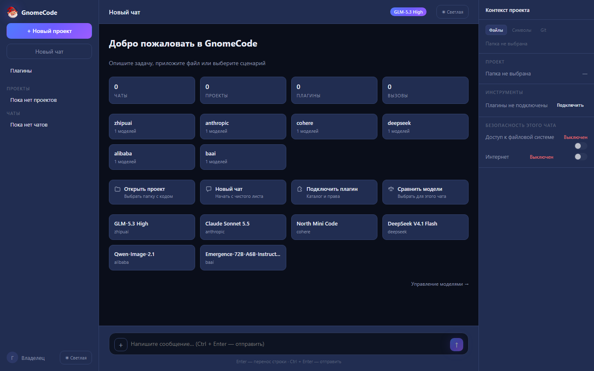
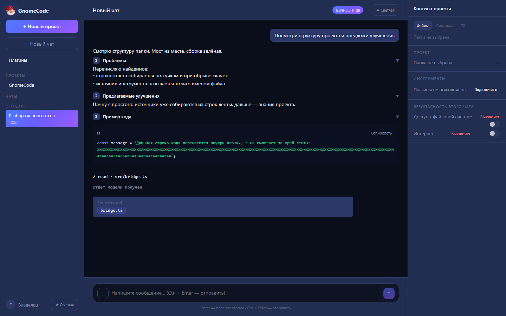
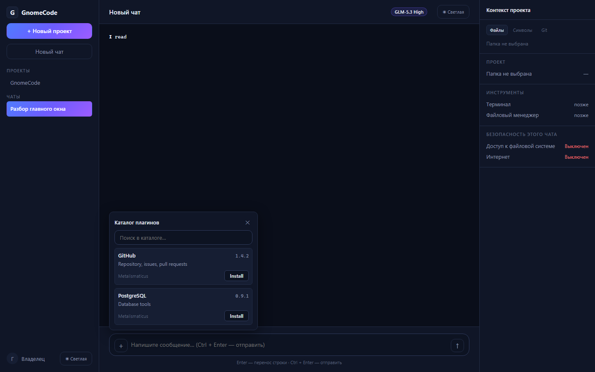

# GnomeCode

Русская версия: [README.ru.md](README.ru.md)

<!-- studio:begin pitch -->
Desktop AI coding client for Windows: multi-model chat over the OpenCode core, tied to your projects, with two-click plugins and per-chat security.
<!-- studio:end pitch -->

<!-- studio:begin status -->
- **Now:** Stage 2 — the full plugin experience: the plugin section, catalog install from GitHub, permission rules, automatic updates at launch, model comparison.
- **Next:** Stage 3 — workspaces, skills and project memory.
<!-- studio:end status -->
<!-- studio:begin features -->
## What works

- App window in three columns; dark and light themes switch the whole window;
  the window is frameless with its own title bar and dragging.
- Chat with the OpenCode engine: the answer streams into the feed; code blocks
  come with highlighting and a copy button; significant answers show
  "Sources used" with links to files.
- Welcome screen with project counters, quick-start scenarios and models;
  chats grouped by "Today / Yesterday" in the sidebar.
- Plugins: the "Available" catalog with search and install, a rights summary
  before enabling, plugin commands as header buttons, automatic updates at launch.
- Permission categories (read/write/network/terminal: allow / ask / deny) in
  the Configure panel of a plugin card; defaults for all plugins in Settings.
- Connection scopes: once, this chat, this project, global; Tool Sets — saved
  plugin groups in one click; favorites and recents in the plus menu.
- The Plugins page: cards with enable/disable/uninstall, call activity and counters.
- Model comparison from opencode.ai: prices per million tokens, benchmarks,
  "Choose" switches the chat's model or the default one.
- Settings: theme and language, default model, provider keys (Windows
  Credential Manager), default permissions, the data folder.
- Chat, theme, project folder and settings survive an app restart; the engine
  session continues; one command checks the whole product.
<!-- studio:end features -->

<!-- studio:begin run -->
## How to run

Requires Windows 10/11 x64, Node 22 and npm, Rust (rustup), Python 3.13 with Pillow, and the OpenCode CLI for the AI core.

```bash
npm install
npm run tauri dev    # opens the app window
```

Quick check of everything: `npm run check`. Full check suite: `python -X utf8 tools/run_checks.py`.
Built copies for trying without the dev setup land in `builds/`.
<!-- studio:end run -->

<!-- studio:begin shots -->
| Main window, dark theme | Question breakdown: steps and code | Plugin catalog |
|---|---|---|
|  |  |  |
<!-- studio:end shots -->

<!-- studio:begin release -->
<!-- studio:end release -->

<!-- Your own text goes anywhere outside the studio:begin / studio:end
markers: studio never changes it. -->

## Docs

- `docs/SPEC/plugins.md` — plugin system spec (installation, chat-level attachment, scopes, security)
- `docs/SPEC/phase2.md` — Phase 2 spec: workspaces, skills, context packs, tasks, Legal/GameDev domains
- `docs/DECISIONS.md` — architecture decisions (ADR)
